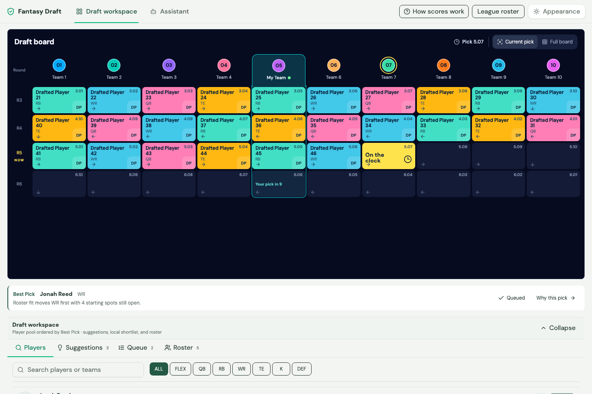
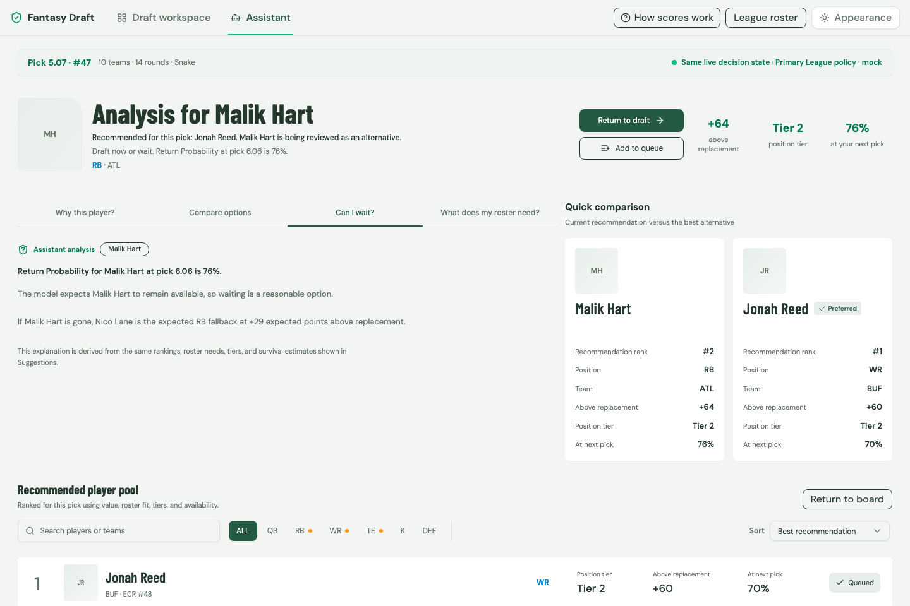

# Fantasy Draft Assistant

A local fantasy football draft assistant for Sleeper, Yahoo, and ESPN. Track
picks, compare available players, and see how each choice fits your roster.
A Chrome extension puts the companion beside the provider's draft room.
Submit your picks in the provider's own draft room.



*Screenshots show the current interface with fictional players and a fixed demo draft.*

## What it does

- **Draft workspace.** Follow the snake draft board, search the player pool, keep a shortlist, and track your roster.
- **Draft decisions.** Compare the Best Pick and Best Player decision lenses. Best Pick accounts for roster fit and draft timing. Best Value lists actionable Sleeper market-discount recommendations. Explanations cover positional depth, tiers, and the chance a player lasts until your next pick.
- **Assistant.** Inspect a recommendation, compare alternatives, ask whether you can wait, and review roster needs. Its answers come from the app's ranking and draft calculations.
- **Live sync.** Connect a provider draft by URL or ID. Sleeper and Yahoo use the local server; ESPN uses observations from your signed-in browser tab.
- **Mock drafts and recovery.** Practice locally. During a live sync outage, record provisional picks and reconcile them when the provider returns.
- **Data readiness.** Missing or stale core inputs block live recommendations. Optional signals can become unavailable without blocking the draft.



## Get started

Requires Node 22.12+, pnpm 9.15.0, and Chrome or Chromium for the extension.
Run these commands from the repository root:

```bash
pnpm install --frozen-lockfile
pnpm dev:live
```

If you have FantasyPros API credentials, first copy `.env.example` to
`.env.local` and set `FANTASYPROS_API_KEY`. See the
[data refresh guide](docs/data-refresh.md) for source options and manual imports.

`pnpm dev:live` refreshes Sleeper and FantasyPros inputs, rebuilds player
identities, validates Core Draft Data, and updates local reports before starting
all development services. Open [localhost:3000](http://localhost:3000), choose
**Connect draft**, and enter the provider draft URL or ID. Confirm your slot,
scoring, roster settings, and keepers against the connected draft.

For development with cached inputs, run `pnpm dev`. It checks the local data
without refreshing source snapshots. The checked-in data is a dated snapshot;
always run the live preflight before drafting.

## Chrome extension

1. With the development watchers running, open `chrome://extensions` and enable Developer Mode.
2. Choose **Load unpacked** and select `extension/dist`.
3. Run `pnpm sync:pair`, open the extension's **Options**, and paste the displayed token to pair it with the local server.
4. Open the provider draft room, then open the extension side panel.
5. After rebuilding or reloading the extension, refresh the provider tab. For ESPN, the observer must start before the page opens its live draft connection.

If the panel shows an old draft, reload the extension, refresh the provider
tab, and reopen the panel. ESPN needs the signed-in draft tab to stay open.
The extension sends sanitized draft state without forwarding account credentials.

## Provider support and current limits

| Provider | Connection | Requirement |
| --- | --- | --- |
| Sleeper | Local server polling | Connect the draft and verify its live settings. The Primary League is the current acceptance profile. |
| Yahoo | Local server polling | Public-read endpoints must expose the draft. Provider changes may require adapter updates. |
| ESPN | Chrome extension observations | Keep the signed-in draft tab open and pair the extension with the local server. |

The server keeps canonical draft snapshots in memory. Both local services bind
to loopback, and API requests require a pairing token. See
[local development](docs/local-development.md#local-api-security) for token
rotation, request limits, and ESPN session reset details.

The recorded real-provider rehearsal is **incomplete**. The September 5, 2026
Sleeper rehearsal verified settings, keepers, and recovery from a local outage,
but the provider draft remained in pre-draft. Full live-pick confirmation,
correction, and completion still need verification. See the
[provider rehearsal record](docs/provider-rehearsal-2026-09-05.md) and
[release-gate report](data/primary-league-release-gate-report.json). The release
gate remains blocked and feature freeze pending until the real-provider rehearsal
and current readiness checks pass.

## Development

```bash
pnpm test                 # Local fixture and mock-based suites
pnpm verify               # Type checks, lint, tests, and builds
pnpm draft:readiness      # Current data blockers
```

Code checks do not refresh live data or establish live draft readiness.
Use the [local development guide](docs/local-development.md) for build commands,
focused tests, and screenshot capture, and [AGENTS.md](AGENTS.md) for contributor
instructions.

## Workspace

| Directory | Responsibility |
| --- | --- |
| `web-app/` | React, Vite, TanStack Query, and Zustand draft interface. |
| `extension/` | Provider-tab detection, ESPN observation, pairing options, and companion panel. |
| `server/` | Local provider adapters, canonical draft snapshots, and SSE updates on port 3001. |
| `shared/` | Domain types, input validation, and the shared sync engine. |
| `scripts/` | Data refreshes, modeling, reports, and release checks. |
| `data/` | Dated source snapshots, league configuration, and generated evidence. |
| `docs/` | Setup details, draft strategy, data guides, and rehearsal records. |

Vite serves an explicit allowlist of browser data from `data/` during development
and copies those files into production builds. Private league history stays
behind the local API. Local audit files and scratch notes are ignored.

## Further reading

| Task | Guide |
| --- | --- |
| Understand product terms and decision lenses | [Domain context](CONTEXT.md) |
| Refresh inputs or trace generated artifacts | [Data refresh](docs/data-refresh.md) |
| Choose sources and their recommendation influence | [Data strategy](docs/data-strategy.md) |
| Build historical datasets or evaluate models | [DuckDB modeling](docs/modeling-duckdb.md) |
| Plan draft decisions and draft-week preparation | [Draft approach](docs/draft-approach.md) |
| Verify a complete draft, outage recovery, or release | [Primary League rehearsal](docs/primary-league-rehearsal.md) |
| Review preparation evidence | [Draft prep report](docs/draft-prep-report.md), [decision experiments](docs/primary-league-experiments.md) |

The acceptance profile lives in [Primary League settings](data/primary-league-settings.json)
and the [keeper list](data/league-history/current-keepers.json). Verify both
against the connected provider before use.
